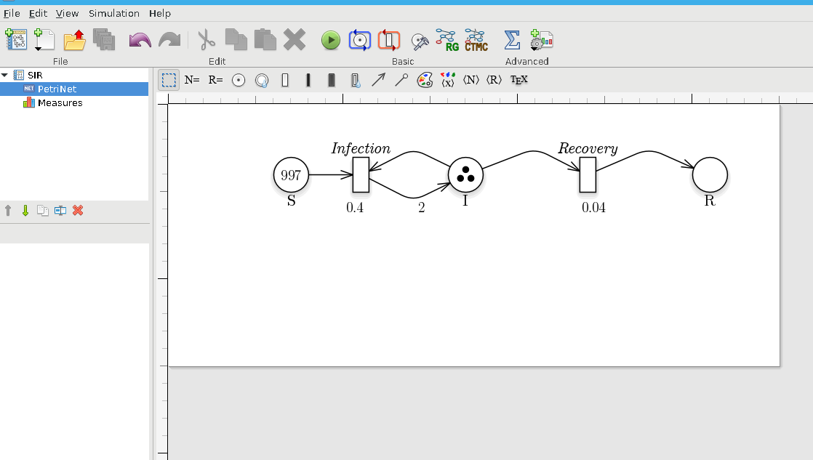
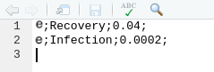
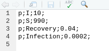
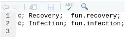
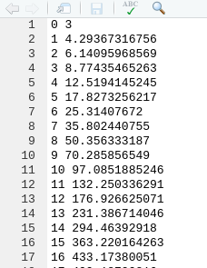

```{r, include = FALSE}
knitr::opts_chunk$set(
  collapse = TRUE,
  comment = ""
 
)
```

	 

# Introduction

In this document we describe how to use the R library *epimod*. In details, *epimod* implements a new general modeling framework  to  study  epidemiological  systems, whose novelties and strengths are: 

1. the use of a graphical formalism to simplify the model creation phase; 
2. the automatic generation of the deterministic and stochastic process underlying the system under study;
3. the implementation of an R package providing  a friendly interface  to access the analysis techniques implemented in the framework;
4. a high level of portability and reproducibility granted by the containerization [@docker] of all analysis techniques implemented in the framework;
5. a well-defined schema and related infrastructure to allow users to easily integrate their own analysis workflow in the framework. 

The effectiveness  of  this  framework is showed through the wellknown and simple SIR model.

# How to start 

Before starting the analysis we have to install (1) GreatSPN GUI, (2) docker, and (3) the R package **devtools** for installing *EPIMOD*.
GreatSPN GUI, the graphical editor for drawing Petri Nets formalisms, is available online  ([link to install GreatSPN](http://www.di.unito.it/~amparore/mc4cslta/editor.html)), and it can be installed following the steps showed therein. Then, the user must have docker installed on its computer for exploiting the *epimod*'s docker images (for more information on the docker installation see: [link to install docker](https://docs.docker.com/engine/installation/)), and to have authorization to execute docker commands reported in the command page of function install docker.
To do this the following commands must be executed.

1. Create the docker group.
```{bash,eval=F}
    $ sudo groupadd docker
```
2. Add your user to the docker group.
```{bash,eval=F}
    $ sudo usermod -aG docker $USER
```

The R package *devtools* has to be installed to run *epimod*:
```{r,eval=F}
install.packages("devtools")
library(devtools)
install_github("qBioTurin/epimod", dependencies=TRUE)
``` 

```{r}
library(epimod)
``` 
Then, the following function must be used to download all the docker images used by *epimod*:

```{r,eval=F}
downloadContainers()
``` 

## Something to know

All the *epimod* functions print the following information:

- *Docker ID*, that is the CONTAINER ID which is executed by the function;
- *Docker exit status*, if 0 then the execution completed with success, otherwise an error log file is saved in the working directory.


# Cases of study
In this section we show the steps necessary to model, study and analyze a simple case study. To this aim, we choose to study the diffusion of a disease following the SIR dynamics. We refer to [@keeling2011modeling] for all the details.

## SIR model

The S-I-R models the diffusion of an infection in a population assuming three possible states (or compartments) in which any invidual in the population may move. Specifically, (1) *Susceptible*, individuals unexposed to the disease, (2) *Infected*, individuals currently infected by the disease, and (3) *Recovered*, individuals which were successfully recovered by the infection.
To consider the simplest case, we ignore the population demography (i.e., births and deaths of individuals are omitted), thus we consider only two possible events: the infection (passage from  *Susceptible* to  *Infected*), and the recovery (passage from  *Infected* to  *Recovered*). We are also assuming to neglect complex pattern of contacts, by considering an homogeneous mixing.
From a mathematical point of view, the system behaviors can be investigated by exploiting the deterministic approach [@Ku70] which approximates its dynamics through a system of ordinary differential equations (ODEs):

```{r , echo = FALSE, message=FALSE, fig.align='center', fig.pos='H'}

```

where:

- $S,\ I,\ R$ are the number of susceptible, infected, and recovered individuals, respectively;
- $\beta$ is the infection rate;
<!-- - $N$ is the constant population size; -->
- $\gamma$ is the recovery rate, which determines the mean infectious period.

## Analysis

### Model generation

The first step is the model construction. Starting with the GreatSPN editor tool it is possible to draw the model using the PN formalism and its generalizations. We recall that the Petri Nets are bipartite graphs in which we have two type of nodes, places and transitions. Graphically, places are represented as circles and those are the variables of our systems. On the other hand, transitions are depicted as rectangles and are the possible events happening in the system. Variables and events (i.e., places and transitions) are connected through arcs, showing what variable(s) is (are) affected by a specific event. 
For more details we refer to  [@PetriNet].

Therefore, as represented in figure \ref{fig:SIR_PN}, we add one place for each variable of the system (i.e., S, I, and R represent the susceptible, infected, and recovered individuals respectively), and one transition for each possible event (i.e., *Infection* and *Recovery*). Finally, we save the PN model as a file with extension *.PNPRO* .

```{r , echo = FALSE, message=FALSE, fig.align='center', fig.cap='\\label{fig:SIR_PN} Petri Net representation of the SIR model.', fig.pos='H',out.width="90%"}

```

Having constructed the model, the generation of both the stochastic (the Continuous Time Markov Chain) and deterministic (ODEs) processes underlying the model is implemented by the *model_generation()* function. This function takes as input the file generated by the graphical editor, in this case called *SIR.PNPRO*, and automatically derives the processes.

```{r, linewidth = 80,eval=FALSE}
library(epimod)
model_generation("SIR.PNPRO")

``` 

The binary file *SIR.solver* is generated in which the derived processes and the library used for their simulation are packaged.


### Model Analysis

A possible step is the model analysis, where the corresponding function *model_analysis()* executes and tests the behavior of the developed model. Furthermore, by changing the input parameters, it is possible to perform a *what-if* analysis or forecasting the evolution of the diffusion process.

```{r, linewidth=80,eval=F }

model_analysis(solver_fname = "SIR.solver",
               parameters_fname = "Functions_list_ModelAnalysis.csv",
               f_time = 100, # days
               s_time = 1,
               )

```

1. **solver_fname**: the \emph{.solver} file generated by the *model_generation* function, that is *SIR.solver*;
2. **parameters_fname**: a textual file in which the  parameters to be studied are listed associated with their range of variability.
This file is defined by three mandatory columns: (1) a tag representing the parameter type: *i* for the complete initial marking (or condition), *p* for a single parameter (either a single rate or initial marking), and *g* for a rate associated with general transitions [@Pernice19] (the user must define a file name coherently with the one used in the  general transitions file); (2) the name of the transition which is varying (this must correspond to name used in the PN draw in GreatSPN editor), if the complete initial marking is considered (i.e., with tag *i*) then by default the name *init*  is used; (3) the function used for sampling the value of the variable considered, it could be either a R function or an user-defined function (in this case it has to be implemented into the R script passed through the *functions_fname* input parameter). Let us note that the output of this function must have size equal to the length of the varying parameter, that is 1 when tags *p* or *g* are used, and the size of the marking (number of places) when *i* is used.  The remaining columns represent the input parameters needed by the functions defined in the third column. 

```{r, echo= FALSE,out.width="50%"}

```


3. **f_time**: the final solution time, for instance 100 days;
4. **s_time**: the time step defining the frequency at which explicit estimates for the system values are desired, in this case it could be set to 1 day.


This function solves the system given a specific parameters configuration which is passed through the function parameter, *parameters_fname*. 

```{r, linewidth=80,echo=F,message=F, results='hide'}
model_analysis(solver_fname = "Net/SIR.solver",
               parameters_fname = "Input/Functions_list_ModelAnalysis.csv",
               f_time = 100, # days
               s_time = 1
)
```

```{r, eval=F}
## How to generate the plots

source("Rfunction/ModelAnalysisPlot.R")

AnalysisPlot = ModelAnalysisPlot(solverName_path = "./results_model_analysis/SIR-analysys-1.trace",
                                 Stoch = F,
                                 print=F)
AnalysisPlot$plAll
```

```{r, fig.height = 4, fig.width = 6, fig.align = "center", fig.pos='H', fig.cap=c(" Deterministic Trajectory considering all places"  ), echo = F,message=F, results='hide'}
source("Rfunction/ModelAnalysisPlot.R")
AnalysisPlot = ModelAnalysisPlot(solverName_path = "./results_model_analysis/SIR-analysys-1.trace",
                                 Stoch = F,print=F)
AnalysisPlot$plAll
```

It is possible also to simulate the stochastic behavior of the system exploiting the  Gillespie algorithm, namely **SSA**, which is an exact stochastic method widely used to simulate chemical systems whose behavior can be described by the Master equations.

```{r, linewidth=80,eval=F }
model_analysis(solver_fname = "SIR.solver",
               parameters_fname = "Functions_list_ModelAnalysis.csv",
               solver_type = "SSA",
               n_run = 500,
               parallel_processors = 2,
               f_time = 100, # days
               s_time = 1
)
```

```{r, linewidth=80,echo=F,message=F, results='hide'}
model_analysis(solver_fname = "Net/SIR.solver",
               parameters_fname = "Input/Functions_list_ModelAnalysis.csv",
               solver_type = "SSA",
               n_run = 500,
               parallel_processors = 2,
               f_time = 100, # days
               s_time = 1
)
```

1. **solver_type**: type of solver to use;
2. **n_run**: number of stochastic simulations to run.

```{r, eval=F}
## How to generate the plots

source("Rfunction/ModelAnalysisPlot.R")

AnalysisPlot = ModelAnalysisPlot(solverName_path = "./results_model_analysis/SIR-analysys-1.trace",
                                 Stoch = T)
AnalysisPlot$plAll
AnalysisPlot$plAllMean
```

```{r, fig.height = 4, fig.width = 6, fig.align = "center", fig.pos='H', fig.cap=c(" Stochastic Trajectories considering the S place."," Stochastic Trajectories considering the I place."  ), echo = F,message=F, results='hide'}

source("Rfunction/ModelAnalysisPlot.R")
AnalysisPlot = ModelAnalysisPlot(solverName_path = "./results_model_analysis/SIR-analysys-1.trace",
                                 Stoch = T,
                                 print=F)
AnalysisPlot$plAll
AnalysisPlot$plAllMean
```

#### What-if analysis

It is possible to change the place marking directly from the  *parameters_fname*:

```{r, echo= FALSE,out.width="50%"}

```


### Calibration analysis

The aim of this phase is to optimize the fit of the simulated behavior to the reference data by adjusting the parameters associated with both Recovery and Infection transitions. This step is performed by the function *model_calibration()*, characterized by the solution of an optimization problem in which the distance between the simulated data and the reference data is minimized, according to the definition of distance provided by the user (**distance_fname**).

```{r, linewidth = 80,eval=FALSE }

model_calibration(solver_fname = "SIR.solver",
                  parameters_fname = "Functions_list_Calibration.csv",
                  functions_fname = "FunctionCalibration.R",
                  reference_data = "reference_data.csv",
                  distance_measure_fname = "mse.R" ,
                  f_time = 100, # days
                  s_time = 1, # day
                  # Vectors to control the optimization
                  ini_v = c(0.035,0.00035),
                  ub_v = c(0.05, 0.0005),
                  lb_v = c(0.025, 0.00025),
                  max.time = 1
                  )

```

1. **solver_fname**: the \emph{.solver} file generated by the *model_generation* function, that is *SIR.solver*;
2. **parameters_fname**: a textual file in which the  parameters to be studied are listed associated with their range of variability.
This file is defined by three mandatory columns (*which must separeted using ;*): (1) a tag representing the parameter type: *i* for the complete initial marking (or condition), *p* for a single parameter (either a single rate or initial marking), and *g* for a rate associated with general transitions [@Pernice19] (the user must define a file name coherently with the one used in the  general transitions file); (2) the name of the transition which is varying (this must correspond to name used in the PN draw in GreatSPN editor), if the complete initial marking is considered (i.e., with tag *i*) then by default the name *init*  is used; (3) the function used for sampling the value of the variable considered, it could be either a R function or an user-defined function (in this case it has to be implemented into the R script passed through the *functions_fname* input parameter). Let us note that the output of this function must have size equal to the length of the varying parameter, that is 1 when tags *p* or *g* are used, and the size of the marking (number of places) when *i* is used.  The remaining columns represent the input parameters needed by the functions defined in the third column. An example is given by the file *Functions_list_Calibration.csv*: 

```{r, echo= FALSE,out.width="50%"}

```

where the rates of the *Recovery* and *Infection* transitions can be calibrated by using the R functions stored in the R script *functions_fname*;

3. **functions_fname**: an R file storing the user defined functions to generate instances of the parameters summarized in the *parameters_fname* file. An example is given by *FunctionCalibration.R*, where the function *recovery.fun* introduced in *Functions_list_Calibration.csv* file is defined in order to return the value (or a linear transformation) of the vector of the unknown parameters generated from the optimization algorithm, namely **x**, whose size is equal to number of parameters in *parameters_fname*. Let us note that the output of these functions must return a value for each input parameter. For instance, to calibrate the transition rates associated with *Recovery* and *Infection*, the functions recovery and infection have to be defined, returning just the corresponding value from the vector **x**, where **x[1]** = *“Recovery rate”*, **x[2]** = * “Infection rate”*, since we do not want to change the vector generated from the optimization algorithm. The order of values in **x** is given by the order of the parameters in *parameters_fname*.

```{r, linewidth = 80 }

fun.recovery<-function(x)
{
    return(x[1])
}

fun.infection<-function(x)
{
    return(x[2])
}
```

4. **reference_data**: a csv file storing the data to be compared with the simulations' result. In *reference_data.csv* we report the SIR evolution starting with 997 susceptible, three infected and zero recovered, with a recovery and infection rates equals to 0.04 and 0.0004 respectively. Notice that the **reference_data**'s rows must be the variable time serie, and so the columns the corresponding values at a specific time.

```{r, echo= FALSE,out.width="50%"}

```

5. **distance_measure_fname**: the R file storing the function to compute the distance (or error) between the model output and the reference dataset itself. The function defining the distance takes in input only the reference data (defined in *reference_data.csv*), and the *simulation output* with the following structure:
```{r, echo= FALSE}
a<-read.csv("Results/results_model_calibration/SIR-calibration-10.trace", header=TRUE,sep=" ")
a[1:7,]
```

an example is given by *mse.R* where a distance measure (based on the squared error distance) as function of the infected individuals is defined:
```{r, linewidth = 80 }
mse<-function(reference, output)
{
    reference[1,] -> times_ref
    reference[2,] -> infect_ref

    # We will consider the same time points
    Infect <- output[which(output$Time %in% times_ref),"I"]
    infect_ref <- infect_ref[which( times_ref %in% output$Time)]

    diff.Infect <- 1/length(times_ref)*sum(( Infect - infect_ref )^2 )

    return(diff.Infect)
}
```

6. **f_time**: the final solution time, for instance 10 weeks (70 days);
7. **s_time**: the time step defining the frequency at which explicit estimates for the system values are desired, in this case it could be set to 1 day;
8. **ini_v**: Initial values for the parameters to be optimized.
9. **lb_v, ub_v**: Vectors with length equal to the number of parameters which are varying. Lower/Upper bounds for each parameter.
10. **max_time**: maximum running time.

Let us observe that: the distance and target functions must have the same name of the corresponding R file.

```{r,eval=F}
# How to generate the plots

source("Rfunction/CalibrationPlot.R")

plots <- calibration.plot(solverName_path = "./results_model_calibration/SIR-calibration-1.trace",
                          reference_path ="reference_data.csv")
plots$plS
plots$plI
plots$plR

```

```{r, fig.height = 4, fig.width = 6, fig.align = "center", fig.pos='H', fig.cap=c("\\label{fig:S_traces_cal}Trajectories considering the S place.","\\label{fig:I_traces_cal} Trajectories considering the I place.", "\\label{fig:R_traces_cal} Trajectories considering the R place."  ), echo = F}
source("Rfunction/CalibrationPlot.R")
plots <- calibration.plot(solverName_path = "Results/results_model_calibration/SIR-calibration-1.trace",
                          reference_path ="Input/reference_data.csv",
                          print=F)
plots$plS
plots$plI
plots$plR

```

In figures \ref{fig:I_traces_cal},\ref{fig:S_traces_cal} and \ref{fig:R_traces_cal} the trajectories with color depending on the squared error w.r.t. reference trend are plotted.
In this case, fixing a maximum number of objective function calls, we obtain the following optimal value for the two parameters:
```{r, echo= FALSE}
load("./Results/results_model_calibration/SIR-calibration_optim.RData")
ret$par
```


# References

<div id="refs"></div>
