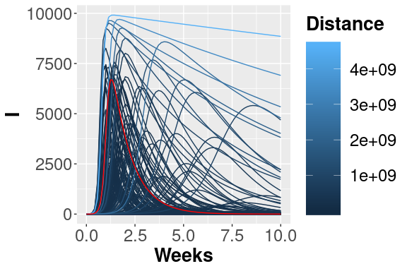
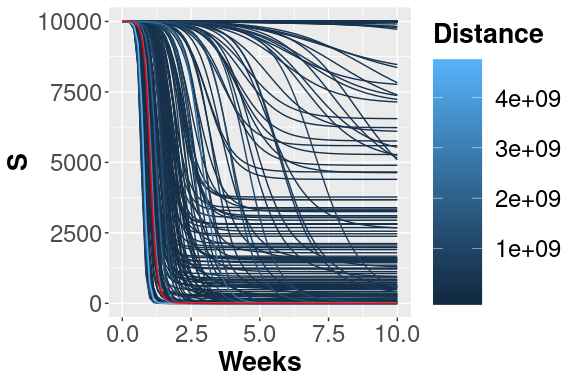
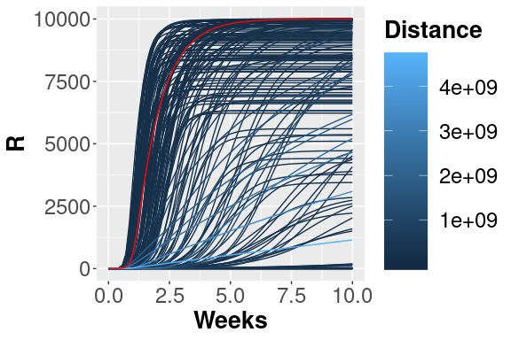
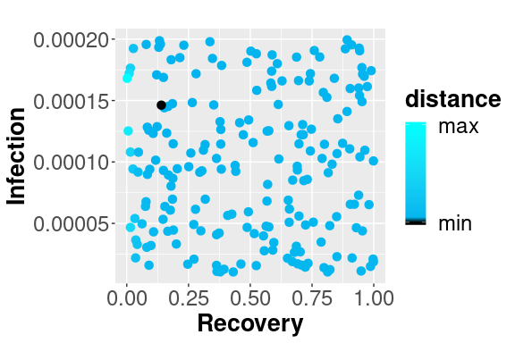
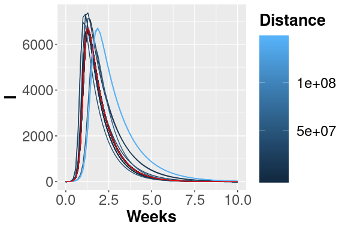
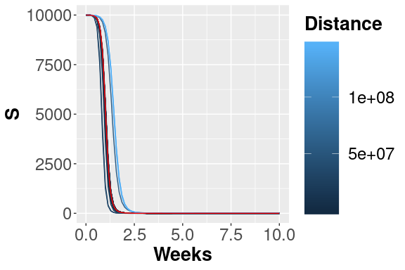
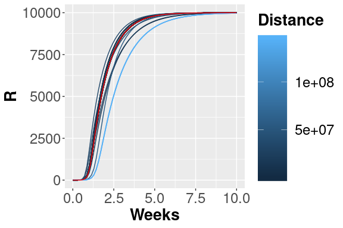

-   [Introduction](#introduction)
-   [How to start](#how-to-start)
    -   [Something to know](#something-to-know)
-   [Cases of study](#cases-of-study)
    -   [SIR model](#sir-model)
    -   [Model generation](#model-generation)
    -   [Sensitivity analysis](#sensitivity-analysis)
    -   [Calibration analysis](#calibration-analysis)
    -   [Model Analysis](#model-analysis)
-   [References](#references)

Introduction
============

In this document we describe how to use the R library *epimod*. In
details, *epimod* implements a new general modeling framework to study
epidemiological systems, whose novelties and strengths are:

1.  the use of a graphical formalism to simplify the model creation
    phase;
2.  the automatic generation of the deterministic and stochastic process
    underlying the system under study;
3.  the implementation of an R package providing a friendly interface to
    access the analysis techniques implemented in the framework;
4.  a high level of portability and reproducibility granted by the
    containerization (Veiga Leprevost et al. 2017) of all analysis
    techniques implemented in the framework;
5.  a well-defined schema and related infrastructure to allow users to
    easily integrate their own analysis workflow in the framework.

The effectiveness of this framework is showed through the wellknown and
simple SIR model.

How to start
============

Before starting the analysis we have to install (1) GreatSPN GUI, (2)
docker, and (3) the R package **devtools** for installing *EPIMOD*.
First, from
[install.GreatSPN](http://www.di.unito.it/~amparore/mc4cslta/editor.html)
it is possible to download and install the GreatSPN editor tool, a Java
Graphic UserInterface (GUI) based on Java Swing Class which allows to
draw models using the Petri Net formalisms. Then, the user must have
docker installed on its computer for exploiting the *epimod*’s docker
images (for more information on the docker installation see:
[install.docker](https://docs.docker.com/engine/installation/)), and to
have authorization to execute docker commands reported in the command
page of function install docker. To do this the following commands must
be executed.

1.  Create the docker group.

<!-- -->

        $ sudo groupadd docker

1.  Add your user to the docker group.

<!-- -->

        $ sudo usermod -aG docker $USER

The R package *devtools* has to be installed to run *epimod*:

    install.packages("devtools")
    library(devtools)
    install_github("qBioTurin/epimod", dependencies=TRUE)

    library(epimod)

Then, the following function must be used to download all the docker
images used by *epimod*:

    downloadContainers()

Something to know
-----------------

All the *epimod* functions print the following information:

-   *Docker ID*, that is the CONTAINER ID which is executed by the
    function;
-   *Docker exit status*, if 0 then the execution completed with
    success, otherwise an error log file is saved in the working
    directory.

Cases of study
==============

In this section we provide an example of *epimod* usage through a simple
case study. In details, the SIR model is the simple case of disease
diffusion that we have chosen and in the following subsections show how
to use *epimod* to model, analyze and study this case. We refer to
(Keeling and Rohani 2011) for all the details.

### SIR model

The S-I-R model simulates a scenario of a disease spreading in which the
population is categorized into three groups: (1) *Susceptible*,
individuals unexposed to the disease, (2) *Infected*, individuals
currently infected by the disease, and (3) *Recovered*, individuals
which were successfully recovered by the infection. To consider the
simplest case, we ignore the population demography (i.e., births and
deaths of individuals are omitted), thus we consider only two possible
events: the infection (passage from *Susceptible* to *Infected*), and
the recovery (passage from *Infected* to *Recovered*). We are also
assuming to neglect complex pattern of contacts, by considering an
homogeneous mixing. From a mathematical point of view, the system
behaviors can be investigated by exploiting the deterministic approach
(Kurtz 1970) which approximates its dynamics through a system of
ordinary differential equations (ODEs):

where:

-   *S*, *I*, *R* are the number of susceptible, infected, and recovered
    individuals, respectively;
-   *β* is the infection rate;
-   *N* is the constant population size;
-   *γ* is the recovery rate, which determines the mean infectious
    period.

### Model generation

The first step is the model construction. Starting with the GreatSPN
editor tool, a Java Graphic User Interface (GUI) based on Java Swing
Class , it is possible to draw the model using the PN formalism and its
generalizations.

Therefore, as represented in figure , we add one place for each variable
of the system (i.e., S, I, and R represent the susceptible, infected,
and recovered individuals respectively), and one transition for each
possible event (i.e., *Infection* and *Recovery*). Finally, we save the
PN model as a file with extension *.PNPRO* .

 Petri Net representation of the SIR model.

Having constructed the model, the generation of both the stochastic (the
Continuous Time Markov Chain) and deterministic (ODEs) processes
underlying the model is implemented by the *model\_generation()*
function. This function takes as input the file generated by the
graphical editor, in this case called *SIR.PNPRO*, and automatically
derives the processes.

    model_generation(net_fname = "./SIR.PNPRO")
    #> docker run --privileged=true  --user=1000:1000 --cidfile=dockerID --volume /home/pernice/GIT/ModelliEpimod/SIR/Files/generation:/home/ -d qbioturin/epimod-generation:latest unfolding2 /home/SIR -long-names
    #> 
    #> 
    #> Docker ID is:
    #>  b2071d054728 
    #> ..
    #> 
    #> 
    #> Docker exit status: 0 
    #> 
    #> docker run --privileged=true  --user=1000:1000 --cidfile=dockerID --volume /home/pernice/GIT/ModelliEpimod/SIR/Files/generation:/home/ -d qbioturin/epimod-generation:latest PN2ODE.sh /home/SIR -M
    #> 
    #> 
    #> Docker ID is:
    #>  20132083c5f8 
    #> ...
    #> 
    #> 
    #> Docker exit status: 0

The binary file *SIR.solver* is generated in which the derived processes
and the library used for their simulation are packaged.

Notice that *model\_generation()* might take as input parameter the C++
file defining the functions characterizing the behavior of general
transitions (Pernice et al. 2019), namely *functions\_fname*. For
instance, if we want to define the transition *Infection* as a general
transition then we have firstly to set, through the GreatSPN GUI tool,
the transition as *General* and name the corresponding rate name as
**FN:NameGeneralFN**, where in this case the *NameGeneralFN* is
**InfectionFunction**. An example is shown in figure .

 Petri Net representation of the SIR model, modelling the Infection
transition as a general transition.

Successively, we to define the C++ file, for instance *transition.cpp*,
storing the general transition definition, which has to be structured as
follow:

    static double Infection_rate = 1.428;

    double InfectionFunction(double *Value,
                             map <string,int>& NumTrans,
                             map <string,int>& NumPlaces,
                             const vector<string> & NameTrans,
                             const struct InfTr* Trans,
                             const int T,
                             const double& time)
    {

        // Definition of the function exploited to calculate the rate,
        // in this case for semplicity we define it throught the Mass Action  law
     
        double intensity = 1.0;
        
        for (unsigned int k=0; k<Trans[T].InPlaces.size(); k++)
        {
            intensity *= pow(Value[Trans[T].InPlaces[k].Id],Trans[T].InPlaces[k].Card);
        }
        
        double rate = Infection_rate * intensity;

        return(rate);
    }

where the fixed input parameters are:

-   **double \*Value**: marking of the Petri Net at time *time*;
-   **map &lt;string,int&gt;& NumTrans**: map which associates the
    transition name with the corresponding index position in the
    *NameTrans* vector;
-   **map &lt;string,int&gt;& NumPlaces**: map which associates the
    place name with the corresponding index position in the *Value*
    vector;
-   **const vector<string> & NameTrans**: vector of the transition
    names;
-   **const struct InfTr\* Trans**: structure generated by GreatSPN, in
    which, given a transition index *T*, it is possible to obtain its
    input places (*Trans\[T\].InPlaces*), and considering the *k* input
    place with *Trans\[T\].InPlaces\[k\].Id* and
    *Trans\[T\].InPlaces\[k\].Card* it is possible to obtain the
    corresponding place index position in the *Value* vector and the arc
    (linking the *k* place with the *T* transition) molteplicity,
    respectively. For instance, with
    *Value\[Trans\[T\].InPlaces\[k\].Id\]* it is possible to obtain the
    marking of the *k*-th input place of *T*-th transition;
-   **const int T**: index of the firing transition;
-   **const double& time** : time.

Notice that the function name has to correspond to the rate name
associated with the general transition, in this case
*InfectionFunction*.

Finally, the process can be derived be the *model\_generation()*
function as follow.

    model_generation(net_fname = "./SIR_generalFN.PNPRO",
                     functions_fname = "./transition.cpp")

### Sensitivity analysis

The second step is represented by the sensitivity analysis, in which the
deterministic process is solved several times varying the values of the
unknown parameters to identify which are the sensitive ones (i.e., those
that have a greater effect on the model behavior), by exploiting the
Pearson Ranking Correlation Coefficients (PRCCs). This may simplify the
calibration step reducing (1) the number of variables to be estimated
and (2) the search space associated with each estimated parameter. With
this purpose, the function *sensitivity\_analysis()* calculates the
PRCCs, and, given a reference dataset and a distance measure, it ranks
the simulations according to the distance of each solution with respect
to the reference one.

In details, the function *sensitivity\_analysis()* takes in input

1.  **solver\_fname**: the file generated by the *model\_generation*
    function, that is *SIR.solver*;
2.  **n\_config**: the total number of samples to be performed, for
    instance 200;
3.  **f\_time**: the final solution time, for instance 10 weeks (70
    days);
4.  **s\_time**: the time step defining the frequency at which explicit
    estimates for the system values are desired, in this case it could
    be set to 1 day;
5.  **parameters\_fname**: a textual file in which the parameters to be
    studied are listed associated with their range of variability. This
    file is defined by three mandatory columns: (1) a tag representing
    the parameter type: *i* for the complete initial marking (or
    condition), *p* for a single parameter (either a single rate or
    initial marking), and *g* for a rate associated with general
    transitions (Pernice et al. 2019) (the user must define a file name
    coherently with the one used in the general transitions file); (2)
    the name of the transition or place which is varying (this must
    correspond to name used in the PN draw in GreatSPN editor), if the
    complete initial marking is considered (i.e., with tag *i*) then
    *init* should be inserted; (3) the function used for sampling the
    value of the variable considered, it could be either R function or
    user-defined function (in this case it has to be implemented into
    the R script passed from the *functions\_fname* input parameter).
    Let us note that the output of this function must have size equal to
    the length of the varying parameter, that is 1 when tags *p* or *g*
    are used, and the size of the marking (number of places) when *i* is
    used. The remaining columns represent the input parameters needed by
    the functions defined in the third column. An example is given by
    the file *Functions\_list.csv*, where we decided to vary the rates
    of the *Recovery* and *Infection* transitions by using the R
    function which generates values following the uniform probability
    distribution on the interval from *min* to *max*. We set *n=1*
    because we must generate one value for each sample.

<!-- -->

    #>   Tag       Name Function Parameter1   Parameter2 Parameter3
    #> 1   p   Recovery    runif        n=1      min = 0      max=1
    #> 2   p  Infection    runif        n=1  min = 1e-05  max=2e-04

Another example might be *Functions\_list2.csv*, where we decide to vary
the initial marking using the following function *init\_generation*
defined in the R script *Functions.R* (see *functions\_fname*
parameter).

    #>   Tag       Name         Function           Parameter1        Parameter2
    #> 1   i       init  init_generation  min_init = 10000*.8  max_init = 10000
    #> 2   p   Recovery            runif                  n=1           min = 0
    #> 3   p  Infection            runif                  n=1       min = 1e-05
    #>   Parameter3
    #> 1           
    #> 2      max=1
    #> 3  max=2e-04

1.  **functions\_fname**: an R file storing the user defined functions
    to generate instances of the parameters summarized in the
    *parameters\_fname* file. An example is given by *Functions.R*,
    where the function *init\_generation* introduced in
    *Functions\_list2.csv* file is defined in order to sample the
    initial number of susceptible between *min\_init* and *max\_init*,
    and fixing the number of infected and recovered to 1 and 0
    respectively.

<!-- -->

    init_generation<-function(min_init , max_init, n)
    {
        S=runif(n=1,min=min_init,max=max_init)
    # It returns a vector of lenght equal to 3 since the marking is 
    # defined by the three places: S, I, and R.
        return( c(S, 1,0) )
    }

1.  **target\_value\_fname**: an R file providing the function to obtain
    the place or a combination of places from which the PRCCs over the
    time have to be calculated. In details, the function takes in input
    a *data.frame*, namely *output*, defined by a number of columns
    equal to the number of places plus one corresponding to the time,
    and number of rows equals to number of time steps defined
    previously. Finally, it must return the column (or a combination of
    columns, see Sec. [Sensitivity Analysis
    Pertussis](#subsec:PRCCpertussis) ) corresponding to the place (or
    combination of places) for which the PRCCs have to be calculated for
    each time step. An example is given in *Target.R*, where the PRCCs
    are calculated with respect to place *I* (infected individuals).

<!-- -->

    Target<-function(output)
    {
        I <- output[,"I"]
        return(I)
    }

1.  **reference\_data**: a csv file storing the data to be compared with
    the simulations’ result. In *reference\_data.csv* we report the SIR
    evolution starting with 10000 susceptible, one infected and zero
    recovered, with a recovery and infection rates equals to 0.1428 and
    1.428 respectively.

<!-- -->

    #>           Time         S        I          R
    #> TimeStep1  0.0 10000.000 1.000000 0.00000000
    #> TimeStep2  0.1  9999.848 1.137136 0.01524425
    #> TimeStep3  0.2  9999.674 1.293078 0.03257922
    #> TimeStep4  0.3  9999.477 1.470399 0.05229125
    #> TimeStep5  0.4  9999.253 1.672030 0.07470625
    #> TimeStep6  0.5  9998.998 1.901306 0.10019506

1.  **distance\_measure\_fname**: the R file storing the function to
    compute the distance (or error) between the model output and the
    reference dataset itself. The function defining the distance takes
    in input only the reference data and the simulation’s output (i.e. a
    trajectory); an example is given by *msqd.R* where a distance
    measure (based on the squared error distance) as function of the
    infected individuals is defined:

<!-- -->

    msqd<-function(reference, output)
    {
        Infect <- output[,"I"]

        diff.Infect <- sum(( Infect - reference )^2 )

        return(diff.Infect)
    }

Let us observe that: (i) the distance and target functions must have the
same name of the corresponding R file,(ii) *sensitivity\_analysis*
exploits also the parallel processing capabilities, and (iii) if the
user is not interested on the ranking calculation then the
**distance\_measure\_fname** and **reference\_data** are not necessary
and can be omitted.

    ## Simple version where only the transition rates vary.
    sensitivity<-sensitivity_analysis(n_config = 200,
                                      parameters_fname = "Functions_list.csv", 
                                      solver_fname = "SIR.solver",
                                      reference_data = "reference_data.csv",
                                      distance_measure_fname = "msqd.R" ,
                                      target_value_fname = "Target.R" ,
                                      f_time = 7*10, # weeks
                                      s_time = 1 # days      
                                      )
    #> docker run --privileged=true  --user=1000:1000 --cidfile=dockerID --volume /home/pernice/GIT/ModelliEpimod/SIR/Files:/home/docker/data -d qbioturin/epimod-sensitivity:latest Rscript /usr/local/lib/R/site-library/epimod/R_scripts/sensitivity.mngr.R /home/docker/data/results_sensitivity_analysis/params_SIR-sensitivity.RDS
    #> 
    #> 
    #> Docker ID is:
    #>  489fab3d1332 
    #> ...
    #> 
    #> 
    #> Docker exit status: 0

Hence, considering the SIR model we can run the *sensitivity\_analysis*
varying the *Infection* and *Recovery* transitions rates in order to
characterized their effect on the number of infected individuals.

 The 200 trajectories considering the I place obtained from different
parameters configurations.

 The 200 trajectories considering the S place obtained from different
parameters configurations.

 The 200 trajectories considering the R place obtained from different
parameters configuration.

 Scatter plot showing the squared error between the reference data and
simulated number of infected. The dark blue points represent the
parameters configuration with minimum error.

From the figures , , and , it is possible to observe the different
trajectories obtained by solving the system of ODEs, represented by eq.
, with different parameters configurations, sampled by exploiting the
function passed through **parameters\_fname**. In figure the distance
values, obtained using the measure definition described before, are
plotted varying the *Recovery* parameter (on the x-axis) and *Infection*
parameter (on the y-axis). Each point is colored according to a
nonlinear gradient function starting from color dark blue (i.e., lower
value) and moving to color light blue (i.e., higher values). From this
plot we can observe that lower squared errors are obtained when
*Recovery* is around 0.13 and *Infection* around 0.00015, thus we can
reduce the search space associated with the two parameters around these
two values.

 PRCC for the I place over time.

The PRCCs values for these two parameters, depicted in figure , with
respect the number of infections over the entire simulated period are
both meaningful, especially in the first part of the simulation,
corresponding to the transient part where the parameters affect mostly
the output. Differently, this effect decreases after the fifth week
where all the deterministic trajectories obtained with different
parameters configurations converge to the same states, see figure .

Other possible examples of how to use this function are reported
hereafter:

    ## Version where only the PRCC is calculated
    sensitivity<-sensitivity_analysis(n_config = 100,
                                      parameters_fname = "Functions_list.csv", 
                                      solver_fname = "SIR.solver",
                                      target_value_fname = "Target.R" ,
                                      parallel_processors = 1,
                                      f_time = 7*10, # weeks
                                      s_time = 1 # days
                                      )

    ## Version where only the ranking is calculated
    sensitivity<-sensitivity_analysis(n_config = 100,
                                      parameters_fname = "Functions_list.csv", 
                                      solver_fname = "SIR.solver",
                                      reference_data = "reference_data.csv",
                                      distance_measure_fname = "msqd.R" ,
                                      parallel_processors = 1,
                                      f_time = 7*10, # weeks
                                      s_time = 1 # days
                                      )

    ## Complete and more complex version where all the parameters for calculating
    ## the PRCC and the ranking are considered, and the initial conditions vary too.

    sensitivity<-sensitivity_analysis(n_config = 100,
                                      parameters_fname = "Functions_list2.csv", 
                                      functions_fname = "Functions.R",
                                      solver_fname = "SIR.solver",
                                      reference_data = "reference_data.csv",
                                      distance_measure_fname = "msqd.R" ,
                                      target_value_fname = "Target.R" ,
                                      parallel_processors = 2,
                                      f_time = 7*10, # weeks
                                      s_time = 1 # days
                                      )

#### Sensitivity analysis with general transitions

Let us consider the example of the SIR model where the *Infection*
transition is defined as general transition, with the porpoise to
varying the *Infection\_rate* constant of the corresponding MA law.
Generally, since all the transition constants are used in the file C++,
then we need to define an R function into the **functions\_fname** which
returns the values that have to be used into the file C++. Therefore, we
have to modify the *Functions\_list* csv as follow in order to associate
with the general transition *Infection* the R function,
*InfectionValuesGeneration*, which generates the values exploited by the
respective function defined in the C++ file, called *trasition.cpp*.

    #>   Tag       Name                   Function Parameter1 Parameter2 Parameter3
    #> 1   p   Recovery                      runif        n=1    min = 0      max=1
    #> 2   g  Infection  InfectionValuesGeneration    min = 0      max=1

Successively, we have to define the *InfectionValuesGeneration* in
*Functions.R*.

    InfectionValuesGeneration<-function(min, max)
    {
        rate_value <-  runif(n=1, min = min, max = max)
        return(rate_value)
    }

Notice that the value (or values) generated are temporarily saved in a
file named as the corresponding name in the *Functions\_list*, in this
case *Infection*. Hence, the file *transition.cpp* has to be modified in
order to read and use the value generated from the R function
*InfectionValuesGeneration*. An example of implementation is the
following, where two functions are defined: (1) *read\_constant()* in
order to read the generated value, which is associated with the right
variable, and (2) *init\_data\_structures()* in order to read the file
only the first time that the function is called.

    static double Flag = -1; 
    static double Infection_rate = 1.428;

    void read_constant(string fname, double& Infection_rate)
    {
        ifstream f (fname);
        string line;
        if(f.is_open())
        {
            int i = 1;
            while (getline(f,line))
            {
                switch(i)
                {
                    case 1:
                        Infection_rate = stod(line);
                        //cout << "p" << i << ": " << line << "\t" << p1 << endl;
                        break;
                }
                ++i;
            }
            f.close();
        }
        else
        {
            std::cerr<<"\nUnable to open " << fname << ": file do not exists\": file do not exists\n";
            exit(EXIT_FAILURE);
        }
    }

    void init_data_structures()
    {
        read_constant("./Infection", Infection_rate);
        Flag = 1; 

    }

    double InfectionFunction(double *Value,
                             map <string,int>& NumTrans,
                             map <string,int>& NumPlaces,
                             const vector<string> & NameTrans,
                             const struct InfTr* Trans,
                             const int T,
                             const double& time)
    {

        // Definition of the function exploited to calculate the rate,
        // in this case for semplicity we define it throught the Mass Action  law
     
        if( Flag == -1)   init_data_structures();
     
        double intensity = 1.0;
        
        for (unsigned int k=0; k<Trans[T].InPlaces.size(); k++)
        {
            intensity *= pow(Value[Trans[T].InPlaces[k].Id],Trans[T].InPlaces[k].Card);
        }
        
        double rate = Infection_rate * intensity;

        return(rate);
    }

### Calibration analysis

The aim of this phase is to optimize the fit of the simulated behavior
to the reference data by adjusting the parameters associated with both
Recovery and Infection transitions. This step is performed by the
function *model\_calibration()*, characterized by the solution of an
optimization problem in which the input distance function with respect
to a reference data is minimized.

The function input parameters are very similar to those introduced for
the *sensitivity\_analysis()*, we have just to modify the
**parameters\_fname** since we do not need to sample the parameter
values. An example is given in *Functions\_list\_Calibration.csv*, where
the first two columns (i.e., type and name) remain unchanged,
differently the functions associated with each rate (defined
*FunctionCalibration.R*) have to return the value (or a linear
transformation) of the vector of the unknown parameters generated from
the optimization algorithm, namely *x*, whose size is equal to number of
parameters in **parameters\_fname**. Let us note that the output of
these functions must return a value for each input parameter.

    #>   Tag       Name   Function Parameter
    #> 1   p   Recovery   recovery       n=1
    #> 2   p  Infection  infection       n=1

For instance, to calibrate the transition rates associated with
*Recovery* and *Infection*, the functions *recovery* and *infection*
have to be defined, returning just the corresponding value from the
vector *x*, where *x\[1\]= “Recovery rate”*, *x\[2\]= “Infection rate”*,
since we do not want to change the vector generated from the
optimization algorithm (see Sec. [Calibration Analysis
Pertussis](#subsec:calibrationPertussis)). The order of values in *x* is
given by the order of the parameters in **parameters\_fname**.

    recovery<-function(x)
    {
        return(x[1])
    }

    infection<-function(x)
    {
        return(x[2])
    }

The remaining parameters are necessary for the optimization process,
such as the vector defining the upper/lower bound limits, the initial
parameters value, and the control parameters of the optimization (see
the R package GenSa (Yang Xiang et al. 2012)).

    model_calibration(out_fname = "calibration",
                      parameters_fname = "Functions_list_Calibration.csv",
                      functions_fname = "FunctionCalibration.R",
                      solver_fname = "SIR.solver",
                      reference_data = "reference_data.csv",
                      distance_measure_fname = "msqd.R" ,
                      f_time = 7*10, # weeks
                      s_time = 1, # days
                      # Vectors to control the optimization
                      ini_v = c(0.15,0.00015),
                      ub_v = c(0.2, 0.0002),
                      lb_v = c(0.1, 0.0001),
                      max.call = 50
                      )
    #> docker run --privileged=true  --user=1000:1000 --cidfile=dockerID --volume /home/pernice/GIT/ModelliEpimod/SIR/Files:/home/docker/data -d qbioturin/epimod-calibration:latest Rscript /usr/local/lib/R/site-library/epimod/R_scripts/calibration.mngr.R /home/docker/data/results_model_calibration/params_calibration.RDS
    #> 
    #> 
    #> Docker ID is:
    #>  e8d10d34fe2f 
    #> ...
    #> 
    #> 
    #> Docker exit status: 0
    #> [1] 0

 Trajectories considering the I place.

Trajectories considering the S place.

 Trajectories considering the R place.

In figures , and the trajectories with color depending on the squared
error w.r.t. reference trend are plotted. In this case, fixing a maximum
number of objective function calls, we obtain the following optimal
value for the two parameters:

    #> [1] 0.1428522382 0.0001428038

#### Calibration analysis with general transitions

Starting from the changes made in the Sensitivity Analysis phase, we
have to add the possibility to save the value passed by the optmization
algorithm instead of the value generated by the function defined by the
user. By default in the calibration phase, the vector *x* of the unknown
parameters, in this case the *Recovery* and *Infection* rates, is passed
to the R functions defined in *Functions.R*. Therefore, we have to
modify the *InfectionValuesGeneration* in order to return the value
contained in *x*, i.e. the second one ( the order is given by the order
of the parameters in **parameters\_fname**). Notice that in the
Sensitivity Analisys phase, the vector *x* is not passed in input so we
can generalized the *InfectionValuesGeneration* as follow in order to
use it in both the analysis phases.

    InfectionValuesGeneration<-function(min, max, x= NULL)
    {
        if(is.null(x))  rate_value <-  runif(n=1, min = min, max = max)
        else rate_value <- x[2]
        
        return(rate_value)
    }

### Model Analysis

The last step is the model analysis, where the corresponding function
*model\_analysis()* executes and tests the behavior of the developed
model. Furthermore, by changing the input parameters, it is possible to
perform a *what-if* analysis or forecasting the evolution of the
diffusion process. This function solves the system given a specific
parameters configuration which is passed through the function parameter,
*parameters\_fname*. In this case, instead of writing a function to
sample or define the parameter variability, we can pass the specific
value obtained from the calibration for generating the corresponding
trajectory.

    #>   Tag       Name Specific value
    #> 1   p   Recovery   0.1428522382
    #> 2   p  Infection   0.0001428038

    model_analysis(out_fname = "model_analysis",
                   solver_fname = "SIR.solver",
                   f_time = 7*10, # weeks
                   s_time = 1,
                   parameters_fname = "Functions_list_ModelAnalysis.csv"
                   )

References
==========

Keeling, Matt J, and Pejman Rohani. 2011. *Modeling Infectious Diseases
in Humans and Animals*. Princeton University Press.

Kurtz, T. G. 1970. “Solutions of Ordinary Differential Equations as
Limits of Pure Jump Markov Processes.” *J. Appl. Probab.* 1 (7): 49–58.

Pernice, S., M. Pennisi, G. Romano, A. Maglione, S. Cutrupi, F.
Pappalardo, G. Balbo, M. Beccuti, F. Cordero, and R. A. Calogero. 2019.
“A Computational Approach Based on the Colored Petri Net Formalism for
Studying Multiple Sclerosis.” *BMC Bioinformatics*.

Veiga Leprevost, Felipe da, Björn A Grüning, Saulo Alves Aflitos, Hannes
L Röst, Julian Uszkoreit, Harald Barsnes, Marc Vaudel, et al. 2017.
“BioContainers: an open-source and community-driven framework for
software standardization.” *Bioinformatics* 33 (16): 2580–2.

Yang Xiang, Sylvain Gubian, Brian Suomela, and Julia Hoeng. 2012.
“Generalized Simulated Annealing for Efficient Global Optimization: The
GenSA Package for R.” *The R Journal*. <http://journal.r-project.org/>.
